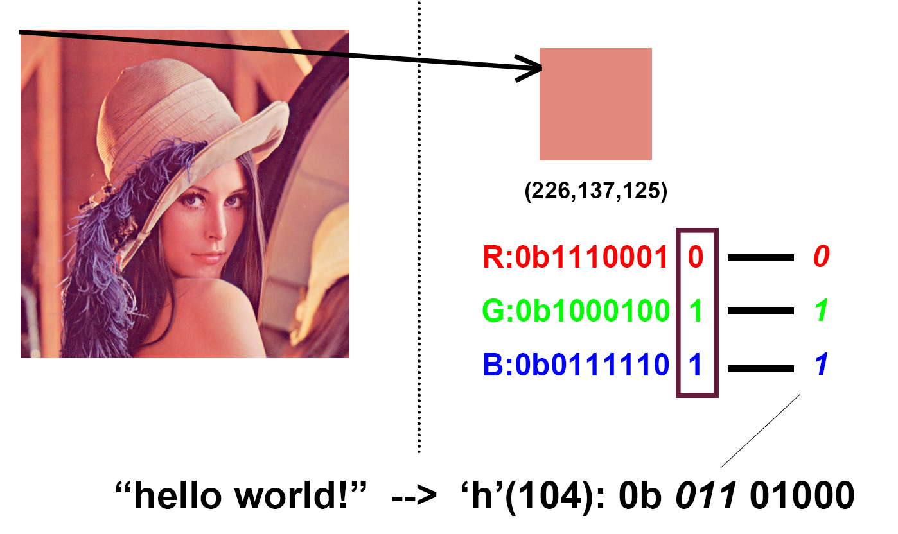
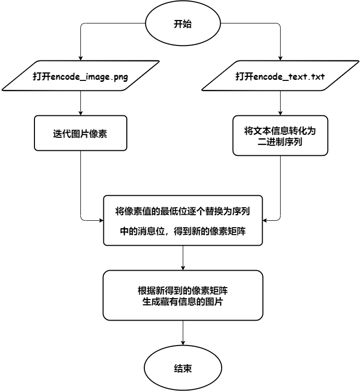
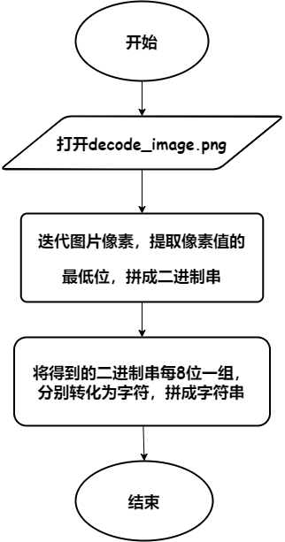
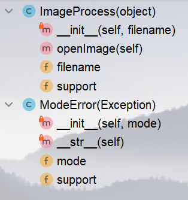
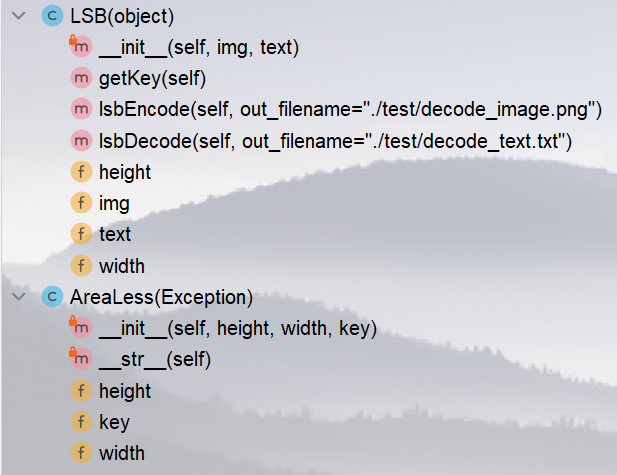
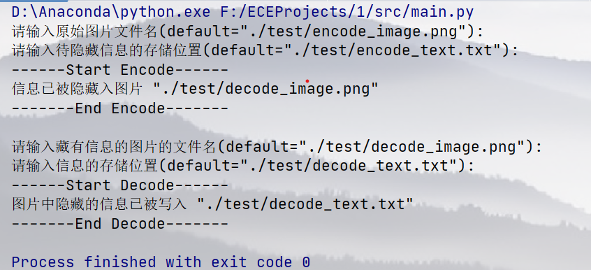

# LSB图像隐写术

## 项目背景

### LSB隐写术

隐写术是一门关于信息隐藏的技巧与科学，所谓信息隐藏指的是不让除预期的接收者之外的任何人知晓信息的传递事件或者信息的内容。LSB 隐写术是一种图像隐写术技术，其中通过将每个像素的**最低有效位**替换为要隐藏的消息位来将消息隐藏在图像中。

### 实现原理

我们将`png`图片看成是一个二维矩阵，矩阵的每个元素表示图片的一个像素点，包含RGB三个值。如果如果修改这些二进制值的最后一位，图片发生的变化是肉眼不能辨别的，这样就达到了隐藏信息的目的， 如下图



#### 加密

为实现将一串文本隐藏到图片中，我们可以先逐个获得文本串的字符的`ASCII`码，形成二进制序列，再迭代图片像素值，将像素值的最低位逐个替换为序列中的消息位。流程如下图：



#### 解密

为提取图片中隐藏的信息，我们只需反转该过程，提取每个像素的最低位，每8位分成一组，分别转化成对应的字符，最后连成字符串即可。流程如下图：



## 项目目标

实现LSB隐写，包括将文本信息隐藏到图片中，提取图片中隐藏的文本信息。

## 环境依赖

本项目采用python3.9.12编写并且需要pillow第三方库以及它的依赖环境。

```shell
pip install -r requirements.txt
```

### 项目结构

```shell
.
├── LICENSE.txt
├── MANIFEST.in
├── README.md
├── README.rst
├── __pycache__
├── dist
│   └── lsb-steg-1.0.0.tar.gz
├── img
│   ├── decode.png
│   ├── encode.png
│   ├── explain.png
│   ├── imgprocess.png
│   ├── logo.ico
│   ├── lsb.png
│   ├── process.png
│   └── result.png
├── lsb_steg.egg-info
│   ├── PKG-INFO
│   ├── SOURCES.txt
│   ├── dependency_links.txt
│   └── top_level.txt
├── setup.py
├── src
│   ├── __init__.py
│   ├── __pycache__
│   │   ├── __init__.cpython-39.pyc
│   │   ├── endetext.cpython-39.pyc
│   │   └── imgprocess.cpython-39.pyc
│   ├── endetext.py
│   └── imgprocess.py
├── test
│   ├── decode_image.png
│   ├── decode_text.txt
│   ├── encode_image.png
│   └── encode_text.txt
└── test.py

7 directories, 29 files
```

```shell
加密程序 位于endetext.py文件 第26行
解密程序 位于endetext.py文件 第69行
```

- **imgprogress.py**，结构如下图
  
  - `ImageProcess`: 根据接收的文件名打开图片，返回`<class 'PIL.PngImagePlugin.PngImageFile'>`
  
  - `ModeError`: 本项目只作用于`RGB`即`png-24`的图片
  
  

- **lsb.py**，结构如下图
  
  - LSB: 接收原始图片和隐藏信息所在文本文件的文件名，用于加密；接收藏有信息的图片的文件名，用于解密
    
    - LSB.lsb_encode:实现LSB加密，另存隐藏有信息的图片
    
    - LSB.lsb_decode:实现LSB解密，将获取的信息存入文本文件
  
  - AreaLess: 确保图片大小足够隐藏待隐藏的信息
  
  

- **main.py**
  
  - 加密：
    
    - 用户输入原始图片和存储信息的文本文件的文件名
    
    - 生成隐藏信息的图片
  
  - 解密
    
    - 用户输入藏有信息的图片的文件名和存储获得信息的位置
    
    - 将获取的信息存储到用户指定的文本文件中

### 项目功能

用户运行`test.py`，根据提示指定要实现的功能，包括加密和解密。交互界面如下图。

- 加密：用户根据提示输入原始图片文件名和隐藏信息的存储位置（若用户无输入，则默认调用`./test`中相应的的测试文件）

- 解密：用户根据提示输入藏有信心的图片的文件名和获取信息的存储位置（若用户无输入，则默认调用`./test`中相应的的测试文件）

